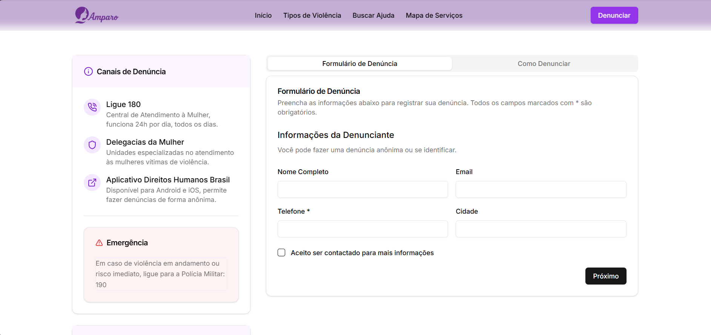
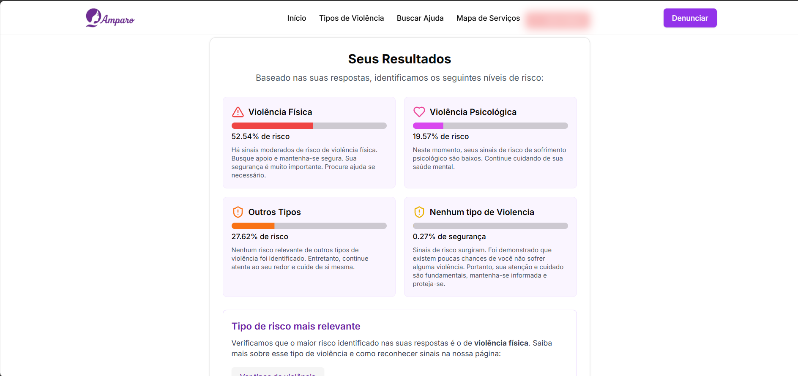

# 🛡️ Projeto Amparo

**Amparo** é uma plataforma digital voltada ao enfrentamento da **violência contra a mulher**, oferecendo um espaço seguro e acessível para **denúncias**, **acolhimento** e **orientação profissional**. A aplicação conta com um **quiz inteligente com IA** que ajuda a identificar situações de risco e fornece encaminhamentos personalizados, além de um sistema de conexão com **psicólogos, assistentes sociais e advogados**.

## 📸 Preview





> 🔒 Os dados sensíveis são tratados com segurança e sigilo, respeitando a privacidade das usuárias.

---

## 🧩 Funcionalidades

- 📄 Formulário seguro para **denúncias anônimas ou identificadas**.
- 🤖 Quiz com **inteligência artificial** que avalia o tipo e gravidade da violência.
- 🧠 Acesso a **profissionais capacitados** (psicólogos, advogados, assistentes sociais).
- 📍 Localização de centros de apoio, delegacias e serviços públicos.
- 📊 Painel para gestão e análise dos dados (uso interno/admin) [Futuro]
- 🕊️ Interface acessível e pensada para mulheres em situação de vulnerabilidade.

---

## 🚀 Tecnologias Utilizadas

### Frontend
- **Next.js** (React)
- **TypeScript**
- **TailwindCSS**
- **Zod / React Hook Form**
- **Shadcn UI**
- **@react-google-maps/api** (para localização de centros de apoio)

### Backend
- **FastAPI**
- **MySql**
- **Python** + Modelos de Machine Learning

---

## 🧠 Inteligência Artificial

O quiz interativo usa um modelo de machine learning treinado com dados reais para prever o tipo de violência (física, psicológica, moral, sexual ou patrimonial) que a mulher podera vir a sofrer. Essa funcionalidade fornece suporte automatizado para tomada de decisão.

---

## 🌐 Deploy

- Frontend: [Vercel](https://vercel.com/) 
- Backend: [Render](https://render.com/) [FUTURO]

---

## 📂 Como Rodar Localmente

### Pré-requisitos
- Node.js
- Python 3.9+
- MySql

```bash
# Clone o repositório
git clone https://github.com/edsay12/amparo.git

# Instale as dependências do frontend
cd frontend
npm install
npm run dev

